# PAIRS UAV System

The **PAIRS UAV System** is a control, estimation, and simulation stack for
multirotor aerial vehicles.
We build it to support safe, replicable real-world experimental validation of
research in planning, control, estimation, computer vision, and tracking.

## System properties

The system is

* built on the [Robot Operating System](https://www.ros.org/) Noetic,
* meant to be executed entirely onboard on a companion computer,
* able to control underactuated multirotor helicopters,
* composed of control, state estimation, mapping, and planning pipelines.

A ROS 2 Jazzy version is in development on the `ros2` branch
([README](https://github.com/pairs-lab/pairs_uav_system/tree/ros2)).

## Documentation

The system is a research-oriented platform that evolves rapidly. Each package
carries its own README; we keep the launch files and the code itself readable so
they double as documentation. We encourage users to look around the packages,
explore the launch files, and read the code.

## Installation

### From the PAIRS apt repository (recommended)

1. Install ROS Noetic and configure your ROS environment per
   [the ROS tutorials](http://wiki.ros.org/ROS/Tutorials/InstallingandConfiguringROSEnvironment).

2. Add the signed PAIRS repository:
```bash
curl -fsSL https://thanhnguyencanh.github.io/apt/KEY.gpg | sudo gpg --dearmor -o /usr/share/keyrings/pairs.gpg
echo "deb [signed-by=/usr/share/keyrings/pairs.gpg] https://thanhnguyencanh.github.io/apt noetic main" \
  | sudo tee /etc/apt/sources.list.d/pairs.list
sudo apt update
```

3. Install the full PAIRS UAV System:
```bash
sudo apt install ros-noetic-pairs-uav-system-full
```

4. Start the example Gazebo simulation session:
```bash
roscd pairs_uav_gazebo_simulation/tmux/one_drone
./start.sh
```

### Docker

A ready-to-run image with the full system pre-installed is published at
[`thanhnc19/pairs_system`](https://hub.docker.com/r/thanhnc19/pairs_system).
See the [pairs_system_docker](https://github.com/pairs-lab/pairs_system_docker)
repository for how to build and run it.

```bash
docker pull thanhnc19/pairs_system:noetic
```

### Start developing your own package

This tutorial assumes you have installed the PAIRS UAV System.

1. Setup a catkin workspace:
```bash
source /opt/ros/noetic/setup.bash             # source the general ROS workspace so that the local one will extend it and see all the packages
mkdir -p ~/workspace/src && cd ~/workspace    # create the workspace folder in home and cd to it
catkin init -w ~/workspace                    # initialize the new workspace
# setup basic compilation profiles
catkin config --profile debug --cmake-args -DCMAKE_BUILD_TYPE=Debug -DCMAKE_EXPORT_COMPILE_COMMANDS=ON -DCMAKE_CXX_FLAGS='-std=c++17 -Og' -DCMAKE_C_FLAGS='-Og'
catkin config --profile release --cmake-args -DCMAKE_BUILD_TYPE=Release -DCMAKE_EXPORT_COMPILE_COMMANDS=ON -DCMAKE_CXX_FLAGS='-std=c++17'
catkin config --profile reldeb --cmake-args -DCMAKE_BUILD_TYPE=RelWithDebInfo -DCMAKE_EXPORT_COMPILE_COMMANDS=ON -DCMAKE_CXX_FLAGS='-std=c++17'
catkin profile set reldeb                     # set the reldeb profile as active
```

2. You can repurpose one of our examples as a starting point (optional):
```bash
# it is good practice to not clone ROS packages directly into a workspace, so let's use a separate directory for this
git clone https://github.com/pairs-lab/pairs_core_examples.git ~/git/pairs_core_examples   # clone the examples repository
export NEW_PACKAGE=replaceme                                                                # fill in your desired new package name (no spaces)
cp -r ~/git/pairs_core_examples/cpp/waypoint_flier ~/git/$NEW_PACKAGE                       # copy an example package (e.g. the waypoint_flier)
cp ~/git/pairs_core_examples/repurpose_package.sh ~/git/$NEW_PACKAGE                        # copy the repurpose_package.sh script to the new package
cd ~/git/$NEW_PACKAGE && ./repurpose_package.sh example_waypoint_flier $NEW_PACKAGE --camel-case  # use the script to replace all occurences of the old name
```

3. Link your package to the workspace and build it (the code below assumes you set the `NEW_PACKAGE` variable):
```bash
ln -s ~/git/$NEW_PACKAGE ~/workspace/src         # create a symbolic link of the package to the workspace
cd ~/workspace/src && catkin build $NEW_PACKAGE  # build the package within the workspace
```

4. Now, you can use the new package:
```bash
source ~/workspace/devel/setup.bash     # source the workspace to see the packages within (if you don't use bash, source the appropriate script instead)
roscd $NEW_PACKAGE                      # now ROS knows about your new package and you can roscd to it
```

**Note:** It is recommended to add the `source ~/workspace/devel/setup.bash` command to your `~/.bashrc` to be executed automatically with every new workspace.

## System components

| Main metapackages       | Contents               | Repository                                                       | Package                            |
|-------------------------|------------------------|-----------------------------------------------------------------|------------------------------------|
| PAIRS UAV System        | UAV Core & UAV Modules | [pairs_uav_system](https://github.com/pairs-lab/pairs_uav_system) | `ros-noetic-pairs-uav-system`      |
| PAIRS UAV System - Full | All of the below       | [pairs_uav_system](https://github.com/pairs-lab/pairs_uav_system) | `ros-noetic-pairs-uav-system-full` |

| Optional Modules & metapackages | Repository                                                                              | Package                                   |
|---------------------------------|-----------------------------------------------------------------------------------------|-------------------------------------------|
| UAV Core                        | [pairs_uav_core](https://github.com/pairs-lab/pairs_uav_core)                                 | `ros-noetic-pairs-uav-core`                 |
| UAV Modules                     | [pairs_uav_modules](https://github.com/pairs-lab/pairs_uav_modules)                           | `ros-noetic-pairs-uav-modules`              |
| Octomap Mapping+Planning        | [pairs_octomap_mapping_planning](https://github.com/pairs-lab/pairs_octomap_mapping_planning) | `ros-noetic-pairs-octomap-mapping-planning` |
| ALOAM Core                      | [pairs_aloam_core](https://github.com/pairs-lab/pairs_aloam_core)                             | `ros-noetic-pairs-aloam-core`               |
| LIO-SAM Core                    | [pairs_liosam_core](https://github.com/pairs-lab/pairs_liosam_core)                           | `ros-noetic-pairs-liosam-core`              |
| Hector Core                     | [pairs_hector_core](https://github.com/pairs-lab/pairs_hector_core)                           | `ros-noetic-pairs-hector-core`              |
| OpenVINS Core                   | [pairs_open_vins_core](https://github.com/pairs-lab/pairs_open_vins_core)                     | `ros-noetic-pairs-open-vins-core`           |
| Precise Landing                 | [pairs_precise_landing](https://github.com/pairs-lab/pairs_precise_landing)                   | `ros-noetic-pairs-precise-landing`          |

| Simulators          | Repository                                                                            | Package                                  |
|---------------------|---------------------------------------------------------------------------------------|------------------------------------------|
| Gazebo Simulation   | [pairs_uav_gazebo_simulator](https://github.com/pairs-lab/pairs_uav_gazebo_simulator)     | `ros-noetic-pairs-uav-gazebo-simulation`   |
| PAIRS Simulation      | [pairs_multirotor_simulator](https://github.com/pairs-lab/pairs_multirotor_simulator)       | `ros-noetic-pairs-multirotor-simulator`    |
| Coppelia Simulation | [pairs_uav_coppelia_simulation](https://github.com/pairs-lab/pairs_uav_coppelia_simulation) | `ros-noetic-pairs-uav-coppelia-simulation` |
| Unreal Simulation   | [pairs_uav_unreal_simulation](https://github.com/pairs-lab/pairs_uav_unreal_simulation)     | `ros-noetic-pairs-uav-unreal-simulation`   |

| Hardware API plugins | Repository                                                                | Package                            |
|----------------------|---------------------------------------------------------------------------|------------------------------------|
| PX4 API              | [pairs_uav_px4_api](https://github.com/pairs-lab/pairs_uav_px4_api)             | `ros-noetic-pairs-uav-px4-api`       |
| DJI Tello API        | [pairs_uav_dji_tello_api](https://github.com/pairs-lab/pairs_uav_dji_tello_api) | `ros-noetic-pairs-uav-dji-tello-api` |

## Example packages

| Examples                    | Repository                                                                                    |
|-----------------------------|-----------------------------------------------------------------------------------------------|
| Core examples               | [pairs_core_examples](https://github.com/pairs-lab/pairs_core_examples)                             |
| Computer Vision examples    | [pairs_computer_vision_examples](https://github.com/pairs-lab/pairs_computer_vision_examples)       |
| Gazebo Custom Drone example | [pairs_gazebo_custom_drone_example](https://github.com/pairs-lab/pairs_gazebo_custom_drone_example) |

## Supported multirotor platforms

The PAIRS UAV System ships with pre-configured models for the following
multirotor platforms:

| Model         | Simulation                    | Real UAV                |
|---------------|-------------------------------|-------------------------|
| DJI f330      | 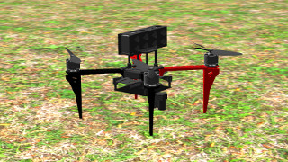 | 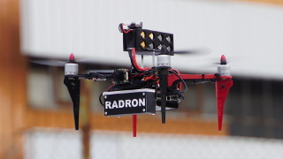 |
| DJI f450      | 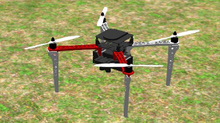 | 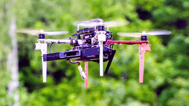 |
| Holybro x500  | 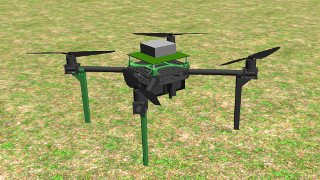 | 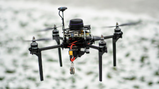 |
| DJI f550      | 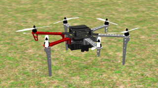 | 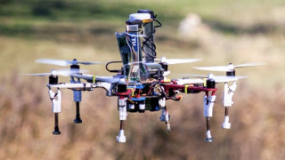 |
| Tarot t650    | 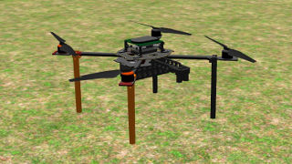 | 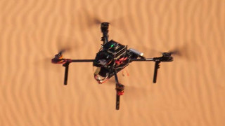 |
| T-Drones m690 | 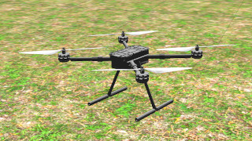 | 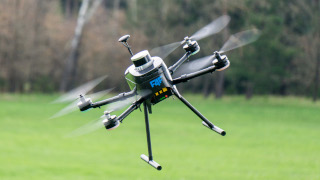 |
| NAKI II       | 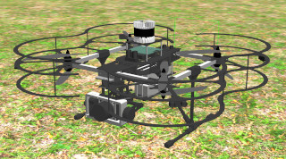 | 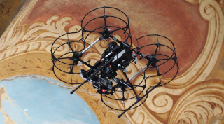 |

## Backwards compatibility and updates

We do not guarantee backward compatibility at any time. The platform evolves
according to the needs of the PAIRS group, and updates may not be compatible
with users' local configs, simulation worlds, or tmux sessions. When a change
requires user action, we will open an issue in this repository labeled
**users-read-me**. Subscribe by clicking the **Watch** button at the top-right
of this page.

# Disclaimer

THIS SOFTWARE IS PROVIDED BY THE COPYRIGHT HOLDERS AND CONTRIBUTORS "AS IS"
AND ANY EXPRESS OR IMPLIED WARRANTIES, INCLUDING, BUT NOT LIMITED TO, THE
IMPLIED WARRANTIES OF MERCHANTABILITY AND FITNESS FOR A PARTICULAR PURPOSE ARE
DISCLAIMED. IN NO EVENT SHALL THE COPYRIGHT HOLDER OR CONTRIBUTORS BE LIABLE
FOR ANY DIRECT, INDIRECT, INCIDENTAL, SPECIAL, EXEMPLARY, OR CONSEQUENTIAL
DAMAGES (INCLUDING, BUT NOT LIMITED TO, PROCUREMENT OF SUBSTITUTE GOODS OR
SERVICES; LOSS OF USE, DATA, OR PROFITS; OR BUSINESS INTERRUPTION) HOWEVER
CAUSED AND ON ANY THEORY OF LIABILITY, WHETHER IN CONTRACT, STRICT LIABILITY,
OR TORT (INCLUDING NEGLIGENCE OR OTHERWISE) ARISING IN ANY WAY OUT OF THE USE
OF THIS SOFTWARE, EVEN IF ADVISED OF THE POSSIBILITY OF SUCH DAMAGE.
